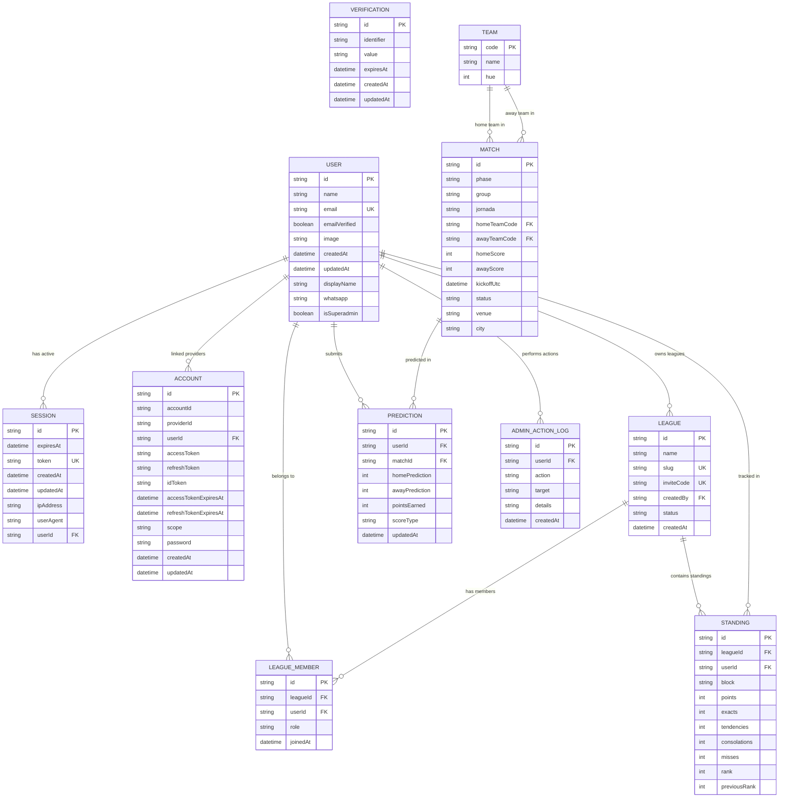

# Database Model — La Polla 2026

We utilize **SQLite** as the primary relational database engine, managed through **Prisma ORM**. Enums are supported at the application level through Prisma client integrations.

---

## Entity-Relationship Diagram

---

## Tables and Columns Specifications

### 1. Authentication Tables (Better Auth adapter)

#### `user`
- `id` (Text, Primary Key) — CUID generator.
- `name` (Text) — Full name.
- `email` (Text, Unique) — Login email.
- `emailVerified` (Boolean) — Verified email state.
- `image` (Text, Nullable) — Profile picture URL.
- `createdAt` (DateTime) — Registration date.
- `updatedAt` (DateTime) — Last profile modification.
- `displayName` (Text, Nullable) — Unique username handle.
- `whatsapp` (Text, Nullable) — Mobile telephone for kickoff notifications.
- `isSuperadmin` (Boolean, Default: `false`) — Super administration toggle.

#### `session`
- `id` (Text, Primary Key) — Session identifier.
- `token` (Text, Unique) — Cookie session token.
- `expiresAt` (DateTime) — Session expiration timestamp.
- `userId` (Text, Foreign Key) — References `user.id` on delete Cascade.
- `ipAddress` (Text, Nullable) — IP of client.
- `userAgent` (Text, Nullable) — Browser client info.
- `createdAt` / `updatedAt` (DateTime).

#### `account`
- `id` (Text, Primary Key) — Credentials record ID.
- `accountId` (Text) — User ID mapping.
- `providerId` (Text) — Sign-in provider (default: "credential").
- `userId` (Text, Foreign Key) — References `user.id` on delete Cascade.
- `password` (Text, Nullable) — Hashed secure credentials.
- `createdAt` / `updatedAt` (DateTime).

#### `verification`
- `id` (Text, Primary Key) — Code ID.
- `identifier` (Text) — Recipient email or handle.
- `value` (Text) — Security token key.
- `expiresAt` (DateTime) — Token expiration timestamp.
- `createdAt` / `updatedAt` (DateTime, Nullable).

---

### 2. Domain Gameplay Tables

#### `team`
- `code` (Text, Primary Key) — ISO 3-letter representation (e.g. `ARG`, `FRA`).
- `name` (Text) — Team display name (e.g. `España`, `Brasil`).
- `hue` (Integer) — Color degree value (0 to 360) used to dynamically style flag discs.

#### `match`
- `id` (Text, Primary Key) — Custom match ID (e.g. `gA1`, `r32_01`).
- `phase` (Text) — Tournament phase name (`groups`, `r32`, `r16`, `quarters`, `semis`, `final`).
- `group` (Text, Nullable) — Group name for group stages (e.g. `A`).
- `jornada` (Text) — Label for matches listing (e.g. `Fecha 1`, `Semifinal`).
- `homeTeamCode` (Text, Foreign Key) — References `team.code`.
- `awayTeamCode` (Text, Foreign Key) — References `team.code`.
- `homeScore` (Integer, Nullable) — Official home team goals.
- `awayScore` (Integer, Nullable) — Official away team goals.
- `kickoffUtc` (DateTime) — Kickoff timestamp in UTC. Used to enforce locking.
- `status` (Text) — Execution state (`open`, `soon`, `live`, `result`).
- `venue` (Text) — Stadium name.
- `city` (Text) — City name.
- *Indexes:* `[phase, status]` and `[kickoffUtc]` for optimized listings and scheduler loops.

#### `league`
- `id` (Text, Primary Key) — CUID generator.
- `name` (Text) — League display name.
- `slug` (Text, Unique) — URL slug mapping.
- `inviteCode` (Text, Unique) — Uniquely generated code to join.
- `createdBy` (Text, Foreign Key) — Owner `user.id`.
- `status` (Text, Default: `active`) — League state (`active`, `archived`).
- `createdAt` (DateTime).

#### `league_member`
- `id` (Text, Primary Key) — CUID.
- `leagueId` (Text, Foreign Key) — References `league.id` on delete Cascade.
- `userId` (Text, Foreign Key) — References `user.id` on delete Cascade.
- `role` (Text, Default: `member`) — Access level (`admin`, `member`).
- `joinedAt` (DateTime).
- *Constraints:* Unique index on `[leagueId, userId]`.

#### `prediction`
- `id` (Text, Primary Key) — CUID.
- `userId` (Text, Foreign Key) — References `user.id` on delete Cascade.
- `matchId` (Text, Foreign Key) — References `match.id` on delete Cascade.
- `homePrediction` (Integer) — Predicted home team goals.
- `awayPrediction` (Integer) — Predicted away team goals.
- `pointsEarned` (Integer, Nullable) — Points awarded after result calculation.
- `scoreType` (Text, Nullable) — Points category (`exact`, `tendency`, `consolation`, `miss`).
- `updatedAt` (DateTime) — Last prediction adjustment.
- *Constraints:* Unique index on `[userId, matchId]` (enforces exactly one prediction per user per match).
- *Indexes:* `[matchId]` and `[userId]`.

#### `standing`
- `id` (Text, Primary Key) — CUID.
- `leagueId` (Text, Foreign Key) — References `league.id` on delete Cascade.
- `userId` (Text, Foreign Key) — References `user.id` on delete Cascade.
- `block` (Text) — Standings segment (`groups`, `knockout`, `global`).
- `points` (Integer, Default: `0`) — Accumulator.
- `exacts` (Integer, Default: `0`) — Exact count accumulator.
- `tendencies` (Integer, Default: `0`) — Tendency count accumulator.
- `consolations` (Integer, Default: `0`) — Consolation count accumulator.
- `misses` (Integer, Default: `0`) — Miss count accumulator.
- `rank` (Integer, Default: `0`) — Active rank position.
- `previousRank` (Integer, Default: `0`) — Previous rank position.
- *Constraints:* Unique index on `[leagueId, userId, block]`.
- *Indexes:* `[leagueId, block]`.

#### `admin_action_log`
- `id` (Text, Primary Key) — CUID.
- `userId` (Text, Foreign Key) — References `user.id` on delete Cascade.
- `action` (Text) — Action label (e.g. `update_score`, `edit_match`).
- `target` (Text, Nullable) — Target entity ID (e.g. `match:gA1`).
- `details` (Text, Nullable) — JSON text summarizing changes.
- `createdAt` (DateTime) — Timestamp.
